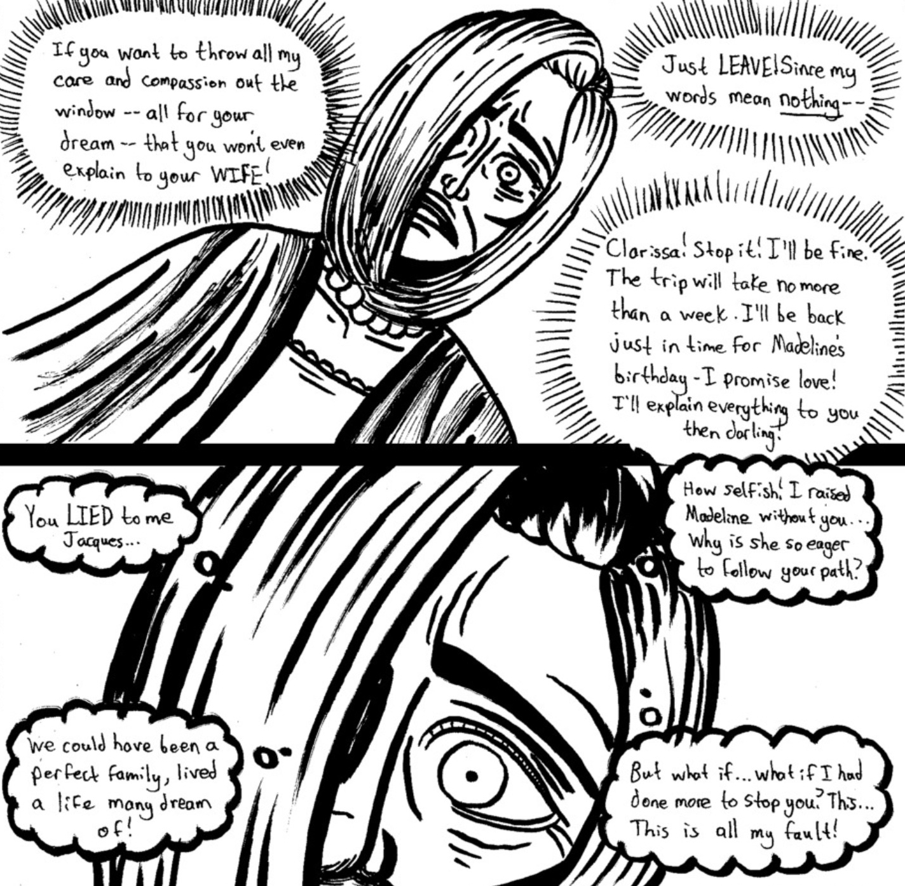

<blockquote>
 "I could have done primary care... radiography... anything really. But I realized that I had a major passion to... to... <b>help</b>... others..."
</blockquote>

-Clarissa Harbour<a href="https://www.ezequielespinoza.com/heroine-rises/3/5">[1]</a>

Dr **Clarissa Lane Harbour**, is the mother of [Madeline Harbour](https://www.ezequielespinoza.com/heroine-rises/madeline-harbour) and a certified private psychiatrist in the city of Northern Serenity. Clarissa was born in the New Serenity neighborhood of Northern Serenity and studied psychiatry at the nearby Glacier Point University. Upon returning to Northern Serenity, she acted as a psychatrist at the Northern Serenity Medical Center before starting her own private practice. 

Clarissa plays a supporting role in Madeline's detective team, offering her expertise when needed and helping when she Madeline allows her to.

##Background

Clarissa was born in the New Serenity neighborhood to wealthy parents. During her childhood, it is implied that she briefly acted as a small-time detective. As a young woman, Clarissa devoted herself to studying psychiatry - specializing in issues faced by adolescent girls. Clarissa earned a bachelors degree at Northern Serenity University before heading to Glacier Point University to complete her medical training. 

Sometime during her residency, Clarissa met and married a man named Jacques Harbour. Clarissa would have her first and only child - Madeline Harbour - before getting her medical degree.  

Clarissa obtained a job as a resident psychiatrist at the Northern Serenity Hospital Center where she worked until she was 35. From there, Clarissa started her own private practice with an office located in the bustling downtown of New Serenity.

After her husband's disapperance, Clarissa struggled to balance her career and her role as a single mother. Clarissa embarked on a journey to find Jacques Harbour but eventually cut her adventure short out of fear that her obsession with finding Jacques would hinder her ability to raise Madeline properly.

##Personality
Clarissa can be described as intelligent, pragmatic, and caring to a fault. Before Madeline, Clarissa and Jacques would embark on expeditions together with Jacques leading Clarissa into situations she found dangerous but exhilirating. 

When Jacques vanished and Madeline came into her life - Clarissa began to show her more pragmatic side. In every situation, Clarissa would choose the less risky route and did whatever she could to protect Madeline from any sort of danger whatseover. Clarissa realizes she is controlling but cannot help herself from shielding her daughter who shares much of her husband's adventurous and risky personality.

</img>
<figcaption>Clarissa's internal fears</figcaption>

Clarissa is shown to care deeply for Madeline and oftentimes is faced with a dilemma of protecting her daughter or letting her live life normally. These confrontations usually bring out an aggressive and fiery side that can result in Clarissa having internal conversations and arguments. However, Clarissa is reasonable and, with some help from Madeline, is able to overcome her fears out of love for Madeline.

In her free time, Clarissa seems to enjoy writing and cooking. Clarissa loves to eat seafood and drink exotic coffee at all hours of the day.

##Appearance and Physical
Clarissa has pale skin and her hair is a platinum blonde cut short just above her shoulders. Her hair is styled so that the right side of her face is covered by a large lock. Her eyes are a light blue. Clarissa stands at 5 feet and 8 inches.

Clarissa often dresses by combining pants with a simple top. She is often seen wearing a cardigan or sweater of sorts when not working at the office. She has a pearl necklace she is fond of and wears it when appropriate.

Physically, Clarissa is not very strong. Due to her not participating in sports or major physical activity since her college days, Clarissa gets winded and fatigued quickly. However, she is able to move rather fast for her age and when angered, can pose a threat to stronger opponents - even if for a short period.

