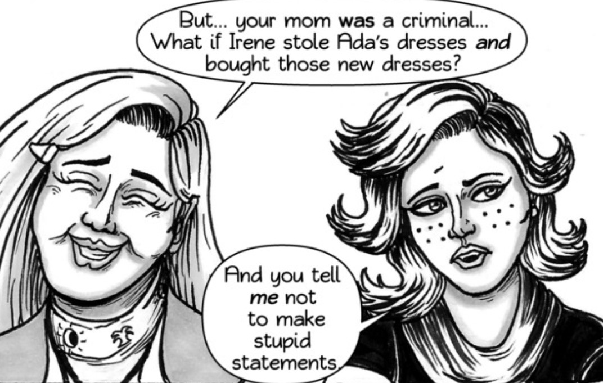
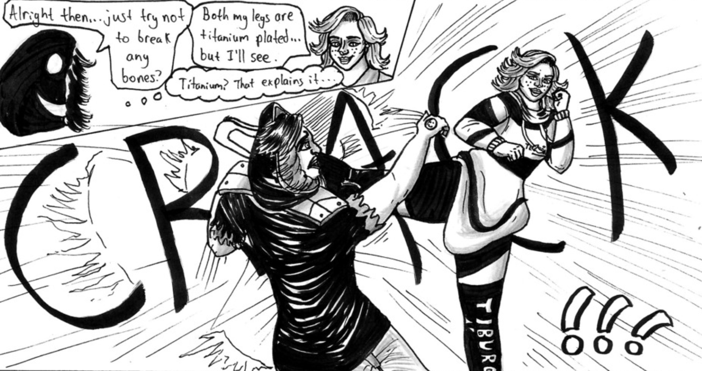

<blockquote>
 "Do you think I could get a copy of your notes Maddie? I want to update my report."
</blockquote>

-Julian Gaitan<a href="https://www.ezequielespinoza.com/heroine-rises/6/3">[1]</a>

**Julian Gaitan Garcia**, called **Jules** by Madeline, is a close friend of Madeline Harbour and acts as a detective assistant within her group - focusing mainly on recordkeeping and research. Julian is a young man who was born in the La Noria neighborhood of Northern Serenity.

Julian

##Personality and Traits

Juliette can be described as sarcastic and sassy but fiercly loyal and caring. Juliette tends to show a 'hardier' side to those she is not fond of or who she has recently met. This often gives people the impression that she is 'rude' - something she takes great issue with since most of her sassy remarks are made with a hint of playfulness rather than malice.  

</img>
<figcaption>Juliette's Sass'</figcaption>

In her interactions with Madeline, Juliette shows a softer side - caring deeply for her best friend's emotional and physical well-being. Juliette greatly respects Madeline and seems to be the only person she will bend to if asked. Juliette seems to be confident in who she is and rarely tries to change who she is in order to fit other people's standards or the situation. This confidence often leads to sticky situations, since Juliette tends to not hold her tounge even in dangerous situations unless Madeline is there to rein her in.

Juliette is able to recognize when someone is distressed or sad and is able to switch between her sassy and brash side to her more caring and empathetic side. This is mostly visible in her interactions with Maxine Rubin because the two women will often be at odds with each other but Juliette will sometimes talk to Maxine in a more caring, friendly way.

##Appearance and Physical
Juliette has a tanned skin tone and reddish-brown shoulder length hair that curls in multiple directions. Juliette suggests that her hairstyle is not 'messy' and is a personal stylistic choice. Juliette has brown eyes with freckles underneath them. She wears winged eyeliner whenever she is out in the city.

Juliette wears athletic clothing for the most part. Her outfits can consist of hoodies, leggings, shorts, compression clothing, sweatpants, and sweatshirts. Juliette tends to avoid wearing dresses or skirts. Juliette is oftentimes wearing a lone piece of jewelry which Madeline notes is of the most expensive kind. She will often wear one earring (pearl or gold hoop) on her left ear or wear some sort of bracelet on one arm. 

</img>
<figcaption>Juliette's Fighting Style</figcaption>

Juliette leads a very active lifestyle and usually spends her free time running or kick-boxing. As a result, Juliette is very fit and usually plays a critical role in the team's physical confrontations. Due to her body being reinforced with titanium plating Juliette is capable of dishing out powerful kicks and can endure much more abuse than Madeline or Julian. Like Madeline, Juliette is able to perform acrobatic manuevers, albeit with more difficulty.

##Biography

###Early Life

####Petit Scholars

####Conflict of Love

####Reunion

####Small Time Detective

###The Ring of Deceit

####True Detective

####Hunt for Irene

####Chasing Shadows

####Woman of the Hour