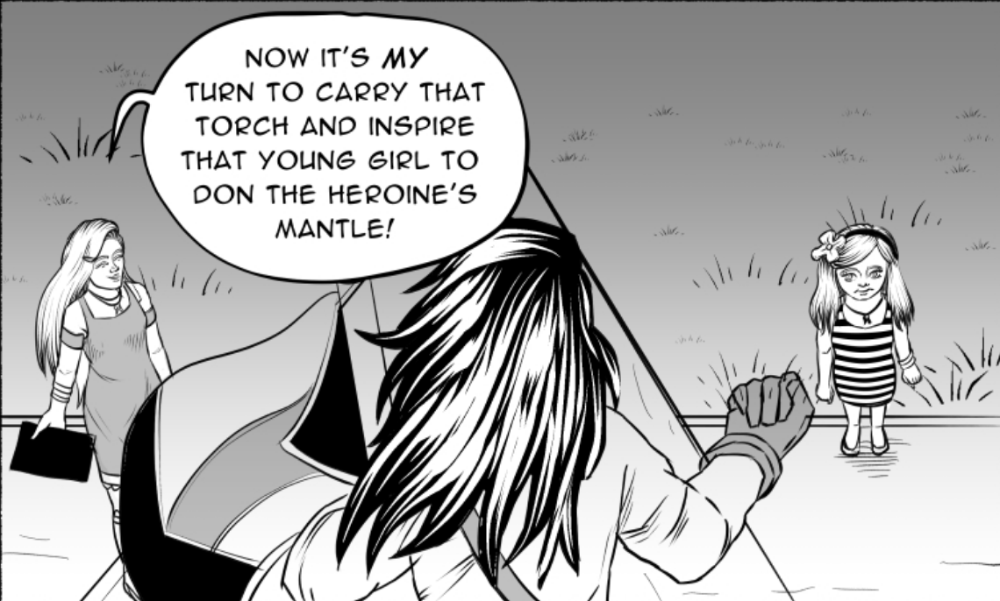
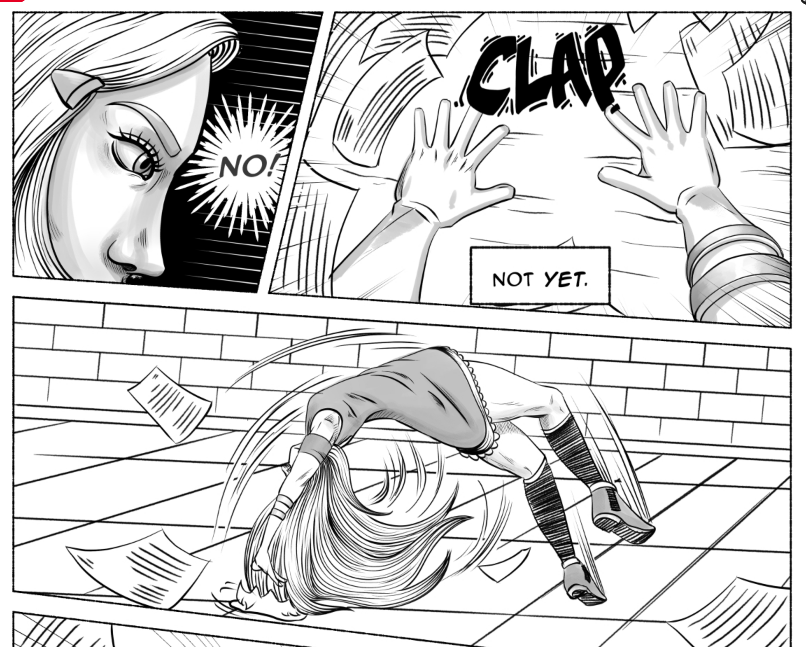
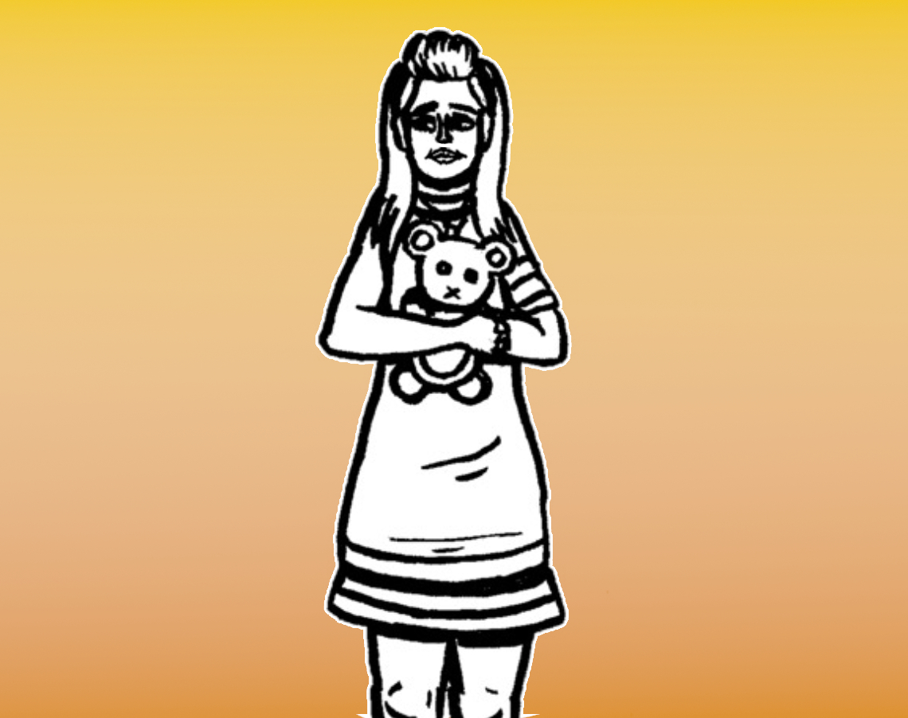
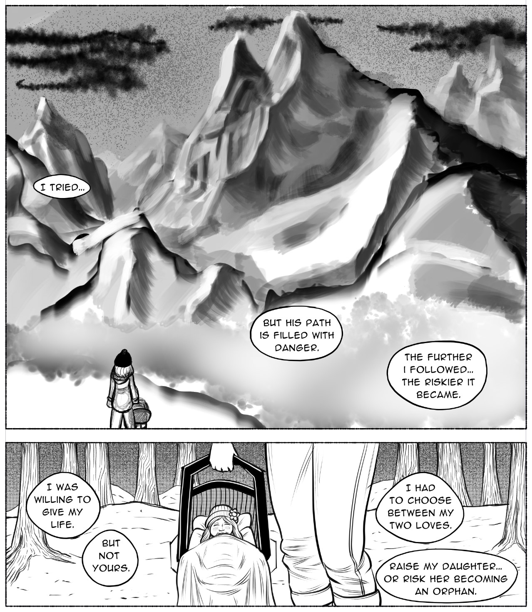
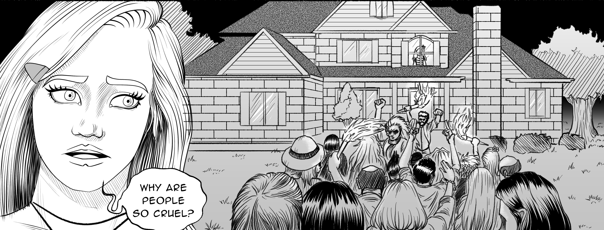
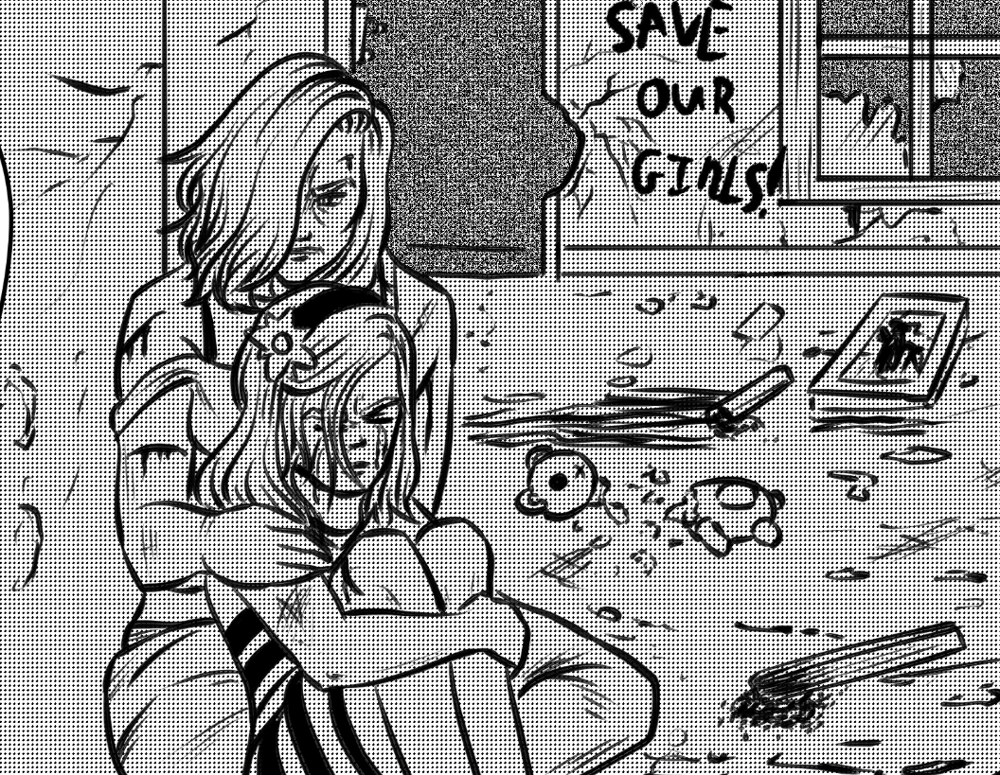
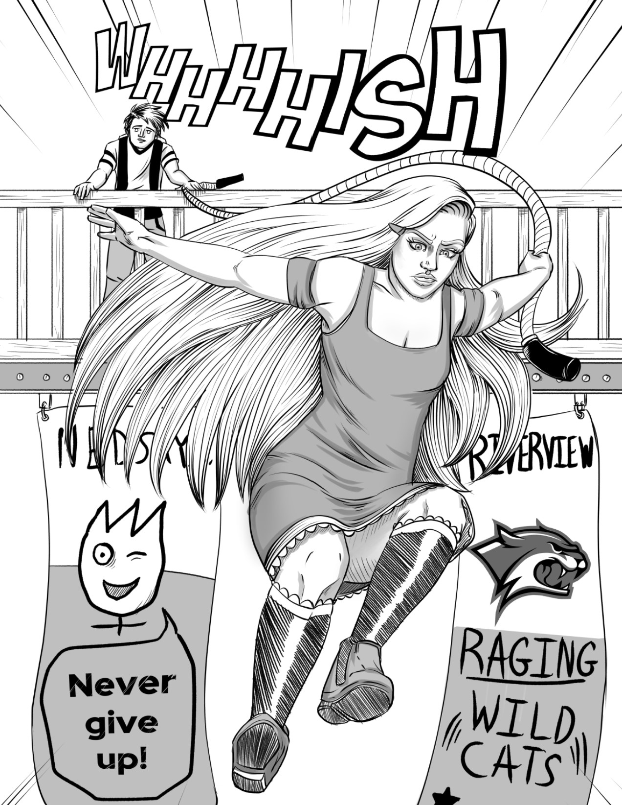
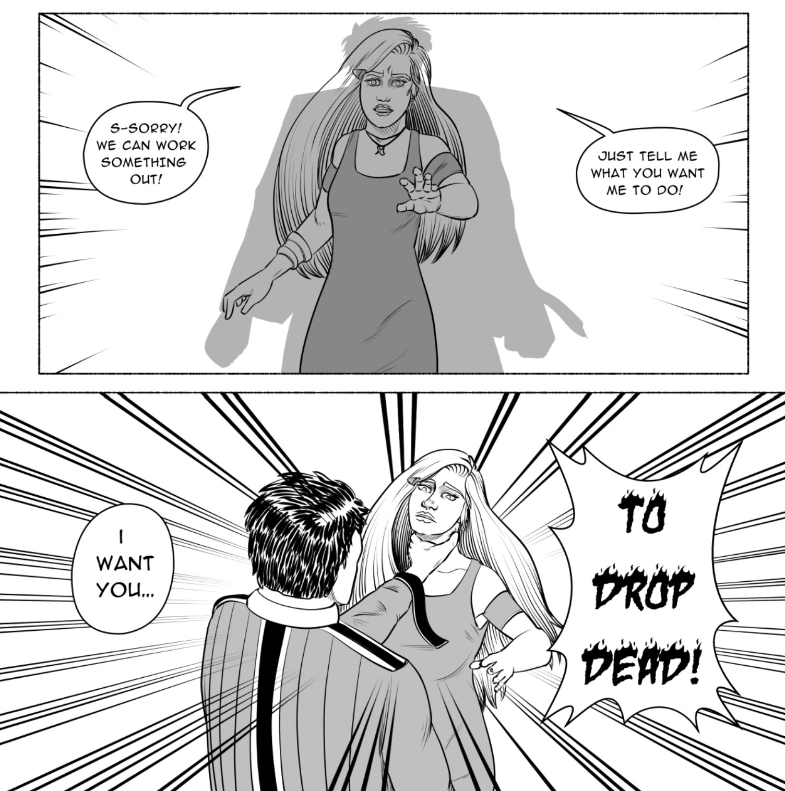
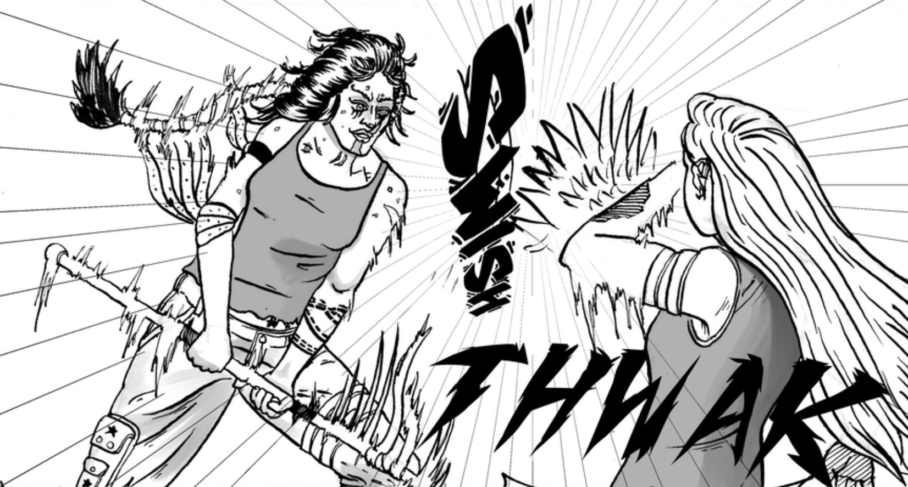

<blockquote>
 "I'm not going to be punching bad guys. I'm just going to look at crime scenes, maybe talk to some suspects - just putting the pieces together. It's not too different from what I'm doing now is it?"
</blockquote>

-Madeline Harbour<a href="https://www.ezequielespinoza.com/heroine-rises/3/6">[1]</a>

**Madeline Lindsay Harbour**, often referred to as **Maddie**, is a young woman who acts as an amateur detective or private investigator within the city of Northern Serenity. Madeline is mainly known for her small-time detective status. During her high school days she would take on small cases and solve them with a combination of careful investigation and luck.

Madeline's altruistic personality drives her to be a role model or 'Heroine' for the community. Madeline has a rather naive outlook on the city as she was born into wealth and has never seen or understands the deeper reasons as to why criminals act the way they do. Therefore, she sometimes comes across as 'out-of-touch'.
Her desire to do good causes her to take on big criminal cases that the local police don't bother with. She starts with the *Ring of Deceit* case. Madeline hopes that by resolving more difficult cases she can eventually solve the mystery behind her father's disappearance.

##Personality and Traits

Madeline can be described as kind, empathetic, optimistic, calculating, and naive. Madeline, much like her mother <a href="https://www.ezequielespinoza.com/heroine-rises/clarissa-harbour" target=" ">Clarissa Harbour</a>, has inherited a compassion for others and does her best to try to understand people's intentions and emotions. This empathy is usually the way she resolves problems - as seen in encounters with Felix Zuniga and <a href="https://www.ezequielespinoza.com/heroine-rises/irene-lassiter" target=" ">Irene Lassiter</a>. Madeline cares deeply for almost everyone and is willing to see past people's flaws and pasts. While this has helped her solve cases and communicate with all sorts of people, this trait is often exploited by foes who are more than willing to betray her trust.

</img>
<figcaption>Madeline Lindsay Harbour</figcaption>

Due to being born wealthy and living in the comfort of the Isle of Tranquility, Madeline does not have a good grasp on what goes on outside of wealthy and privileged lifestyles. At the start of her journey, Madeline tries to apply her worldview to make sense of the actions of those less fortunate than her. This can be seen in her first encounter with Jimmy Jarvis. During this encounter, Jimmy showed frustration at Madeline's responses to his explanations. Madeline told Jimmy that he cheated on tests due to a lack of study time. Jarvis responds by telling her that his rough lifestyle does not grant him the luxuries that Madeline has taken for granted. In further encounters with people like Felix Zuniga and Irene Lassiter, Madeline does this again. However, as time passes, Madeline learns from her mistakes and does her best to try and understand that there are many different situations and holds her tongue before speaking.

Madeline often shifts between a strong leader and an insecure imposter. Bluffing is something she does often, but her confident facade can easily collapse if someone presses her as seen when Irene Lassiter challenges that bluff by pinning Clarissa.
Madeline feels the weight of being the leader and admits that it can be overwhelming for her, as she is expected to make the hard decisions during investigations.

While Madeline typically sports a calm and balanced temper, in extreme cases Madeline tends to become extremely reckless and bold. This trait often puts herself and others in danger but as noted by <a href="https://www.ezequielespinoza.com/heroine-rises/julian-gaitan" target=" ">Julian Gaitan</a>, the reckless acts are often successful despite the costs.

</img>
<figcaption>Madeline looking up to a statue of Governess Maya Grant</figcaption>

Madeline’s desire to become a heroine stem from her idolization of other powerful women she’s seen while growing. Maya Grant and Clarissa Harbour seem to be some of her biggest role models. Traumatic events during Madeline’s youth due to the Isle’s prejudice against homosexuality drive Madeline to do whatever she can to prevent anything similar from happening to anyone else.

##Apperance and Physical

</img>
<figcaption>Madeline's dresses</figcaption>

Madeline has fair-colored skin and long straight blonde hair that reaches halfway down her back. Her eyes are a light blue. She stands at five foot 7 inches but often times wears shoes that make her a few inches taller.

</img>
<figcaption>Madeline performing a handspring in the midst of pursing Damien Schmidt</figcaption>

Madeline often wears dresses and is very fond of the color orange - which she incorporates into most of her outfits. Madeline wears a hair clip on the right side of her head that matches or compliments the color of her current outfit. She sometimes wears a necklace in the shape of the letter 'H'. Madeline always has a golden bracelet on one of her arms that doubles as a GPS tracker. She is also fond of boots and closed toe shoes with a heel to make her appear taller. Madeline likes to add a jacket or vest atop her dresses.

Madeline has a thin body build and is capable of acrobatic feats like handstands, cartwheels, and flips due to her gymnastics background. Madeline is remarkably flexible and agile. While she lacks muscle and combat intelligence, Madeline poses a geniune threat in battles due to her nimble movement, quick thinking, and tendency to use tools and the environment to her advantage.

##Biography
###Early Life

</img>
<figcaption>A young Madeline Harbour</figcaption>

Madeline was born on October 14th to Clarissa and Jacques Harbour on the Isle of Tranquility neighborhood in the city of Northern Serenity. 
Being born in October, Clarissa would always dress Madeline in orange - a habit she has retained. Madeline was close with both of her parents and was a well-liked girl among the people of the Isle of Tranquility.

####Jacques’ Disappearance

</img>
<figcaption>Madeline and Clarissa visit Onyx Peak, Glacier Point</figcaption>

When Madeline was 4, her father Jacques began to isolate himself from the family which led to Madeline becoming uneasy and sad. Shortly after, Jacques went missing with his final known location being the island of Glacier Point.
After Jacques vanished, Clarissa Harbour ventured out with Madeline to Glacier Point to conduct her own investigation at Glacier Point, tracking down Jacques’s path to Onyx Peak. Not willing to risk her daughter’s life, Clarissa opted to abandon the investigation and raise Madeline alone in the safety of their Isle home. From here forward, Madeline’s adventurous spirit clashed with Clarissa’s resistance to take risks.

####'Brave Naivete'

Tired of seeing her mother depressed over the loss of Jacques, Madeline vowed to find Jacques when she grew older. Thanks to Madeline’s optimism, Clarissa was at least able to function and live life in relative stability with her daughter. Eventually, Clarissa would allow Madeline to participate in team sports like soccer. However, after Madeline was hurt, Clarissa pulled Madeline from the team and placed her in a gymnastics program. Here, Madeline excelled and continued to do so until she got hurt on the floor and Clarissa pulled her from all sports.

In early elementary school, Madeline met Julian Gaitan but the two wouldn't become close friends until later.

Later during elementary school Madeline met <a href="https://www.ezequielespinoza.com/heroine-rises/juliette-sandover" target=" ">Juliette Sandover</a> and witnessed Juliette get brutalized by Jimmy Jarvis. During this encounter Madeline naively stood up to Jimmy only to receive a punch to the face that knocked out her remaining baby teeth. Madeline was rescued by Clarissa, who made it a priority to get Jimmy expulsed from the school. Juliette became indebted to Madeline and the two would become best friends.

####Conflict of Love

During Madeline’s middle-school years she met Julian Gaitan who quickly forged a friendship with Madeline. This friendship eventually became a one-sided infatuation on Julian’s part. This would cause a conflict between the two as Madeline did not share any romantic interest towards Julian or any males. Madeline would eventually realize that she was gay after a series of problematic encounters with Julian, Juliette, and Madeline’s romantic interest in her neighbor Claire Ravitsky. Julian, feeling dejected, leaves Madeline’s friend circle.

####Anti-Madeline Sentiment

After coming out, Madeline’s relationship with Claire comes under scrutiny by Claire’s parents in Ed and Paige Ravitsky. Following a confrontation with Clarissa, the Ravitsky adults move to ‘protect’ their daughter from ‘sin’. The family act at meetings, turning other neighbors against Madeline and stoking hatred because of her sexuality.

</img>
<figcaption>Madeline recalls the 'Anti-Madeline' mob</figcaption>

One night, Claire decides to run away from home after her parents’ intentions become clear. Claire runs to the Harbour home to warn Madeline of the incoming ‘protest’ that her father planned to turn violent. Despite Claire’s warning, Madeline and her mother become trapped within their home as a angry mob descends upon it. Ed Ravitsky accuses Clarissa and Madeline of kidnapping his daughter and trying to convert her to a lesbian. While half of the mob is incited by the presence of homosexuality, the other half rallies behind the anger to save the young Claire. The mob are held back by Clarissa but eventually they break into the home and try to burn it to the ground. Clarissa and Madeline hide before the mob can get to them.

</img>
<figcaption>Clarissa comforts Madeline after the riot</figcaption>

Claire manages to escape to the nearest NSPD outpost and inform them of the events. Commander Ashley Carter is deployed to quell the riot and rescues the Harbour women in time. After Clarissa and Claire explain the truth about what happened, most of the neighbors turn against Ed and Paige.

Claire and Madeline share a heartfelt goodbye and Claire thanks Madeline for breaking the mold and coming out despite the consequences. Claire hopes to one day be at peace with her own sexuality and claims that when she does, it will be because Madeline laid the blueprint. The Ravitskys move out of the neighborhood and while most of them apologize for their involvement, a portion still hold onto their ‘Anti-Madeline Sentiment’.

####Small-Time Detective

</img>
<figcaption>Madeline jumps down a stairwell to catch Damien Schmidt</figcaption>

After receiving news of the mob riot, Julian arrived to ask for forgiveness and to help with the clean-up. Madeline accepts Julian’s apologies despite Juliette’s opposition. In an attempt to move beyond the mob violence and the past, Madeline decides to become a detective after reading an issue of the Darling Detective magazine. Madeline’s first case involved finding a lost kitten in the neighborhood of the Isle of Tranquility. Finding the kitten in a tree, Madeline proceeded to climb the tree and get stuck, ultimately diving into the water in order to get down with the kitten.

In high school Madeline became well known for her detective skills and her knack for solving the case in strange and unorthodox methods. Her reputation in the school and local neighborhood became more and more respected. While Juliette opted to stay out of Madeline’s hobby, finding it boring – Julian would become Madeline’s assistant and take on the role of documenting clues and preparing case files.

In the final week of high school, Madeline took on her final case as a small-time detective and worked to discover who was behind the theft of an answer sheet. Her investigation led her to Damien Schmidt, who then confessed to working for Jimmy Jarvis.

###The Ring of Deceit

<blockquote>
 "If I don't move forward now... then when? How much longer will I keep mom and dad waiting? If I want to become a heroine... for mom, dad, and eventually the city... this is the only way."
</blockquote>

-Madeline Harbour's reasoning for accepting the Ruby Ring case.<a href="https://www.ezequielespinoza.com/heroine-rises/1/9">[2]</a>

####True Detective

</img>
<figcaption>Madeline is overpowered by Jimmy Jarvis</figcaption>

Eager to take on bigger cases than simple ‘small-time’ investigations, Madeline and Julian agree to meet with <a href="https://www.ezequielespinoza.com/heroine-rises/ada-lima" target=" ">Ada Lima-Silva</a> to discuss the theft of a stolen Ruby Ring. Madeline hoped to use this case as a steppingstone to find out what happened to her father. In her first test, Jimmy Jarvis confronts the Madeline and Julian duo and immediately overpowers the two, forcing a last second rescue by Commander Ashley Carter once again.

Sensing that she and Julian were not strong enough to face threats like Jimmy, Madeline convinced Juliette to join her investigative team to add some ‘steel’. Then, Madeline confronted her mother and gets the green light to investigate Ada’s missing Ring.

Madeline met with Ada and learned of the Ring’s history within the Lima family and the conflict that emerged between the Lima siblings. Madeline met with Ada’s husband Robert Silva and gained access to multiple clues including a necklace that belonged to a former housekeeper named Irene Lassiter. Robert tells Madeline that he does not know where Irene is but suggests she start her trail by meeting with local jeweler Jamie Banks.

Madeline met with Jamie Banks who explained that Irene was a former member of the La Faccion gang. Undeterred, Madeline obtained the address from Jamie Banks and opted to keep her mother in the dark about going after Irene.

####Hunt for Irene
Madeline and Juliette headed to the address only to find Felix Zuniga, the ‘son’ of Commander Lorena Zuniga of La Faccion. Felix fired his rifle at the girls and after Juliette was downed by Felix, Madeline managed to bury a chain in the ground. When Felix punches her back, the chain trap immobilized Felix which allowed Juliette to deliver a knockout kick. Impressed with Madeline’s efforts, Lorena Zuniga pointed Madeline to Grant Park to find <a href="https://www.ezequielespinoza.com/heroine-rises/maeve-colbrun" target=" ">Maeve Colbrun-Lassiter</a>, Irene’s daughter. Madeline agreed to help Lorena bring Irene back into La Faccion and offered some reassurance to the embarrassed Felix.

</img>
<figcaption>Madeline confronts Irene Lassiter</figcaption>

Madeline waited for Julian to arrive, and the trio find Maeve and have her guide them through the Coastal Swamp to Irene’s trailer home. Shortly after, Irene arrived to the trailer and proceeded to attack the trio – overpowering Julian. Madeline was able to piece together enough information from Maeve and Irene to determine that Irene would only stop if Maeve stood up to her. In an attempt to coerce Maeve, Madeline confronts Irene and endured a barrage of strikes from the woman’s staff before Maeve finally cracked and challenged her mother. Irene stood down and apologized to the trio before inviting them inside to discuss the investigation.

After hearing Irene and Maeve’s testimonies, Madeline is forced to doubt her evidence despite the obvious implications that Irene was the one who stole the Ring. Irene and Maeve continued to point out inconsistencies in Robert’s story and Madeline agreed to ask Robert about how he obtained the necklace and the real reason he fired Irene.

Immediately after, Clarissa Harbour arrives at the trailer courtesy of the GPS bracelet on Madeline’s arm. During the ensuing fight between the two mothers, Madeline’s confident façade and leadership collapsed.

####Chasing Shadows
####Woman of the Hour
####Hunt for Jacques
####Rescue at the Citadel
####Facing the 'Roaring Forces'
####Infiltrating Serenity Underground
####Ruby Mine Conflict
####A Heroine Rises
###The Heroic Villainess
####Laying Low
####Return to Onyx Peak
####Golden Hour
####Maeve Rescue Mission
####Battle of the Bridge
####Turning ‘Rouge’
####Second Battle of Iron Works

