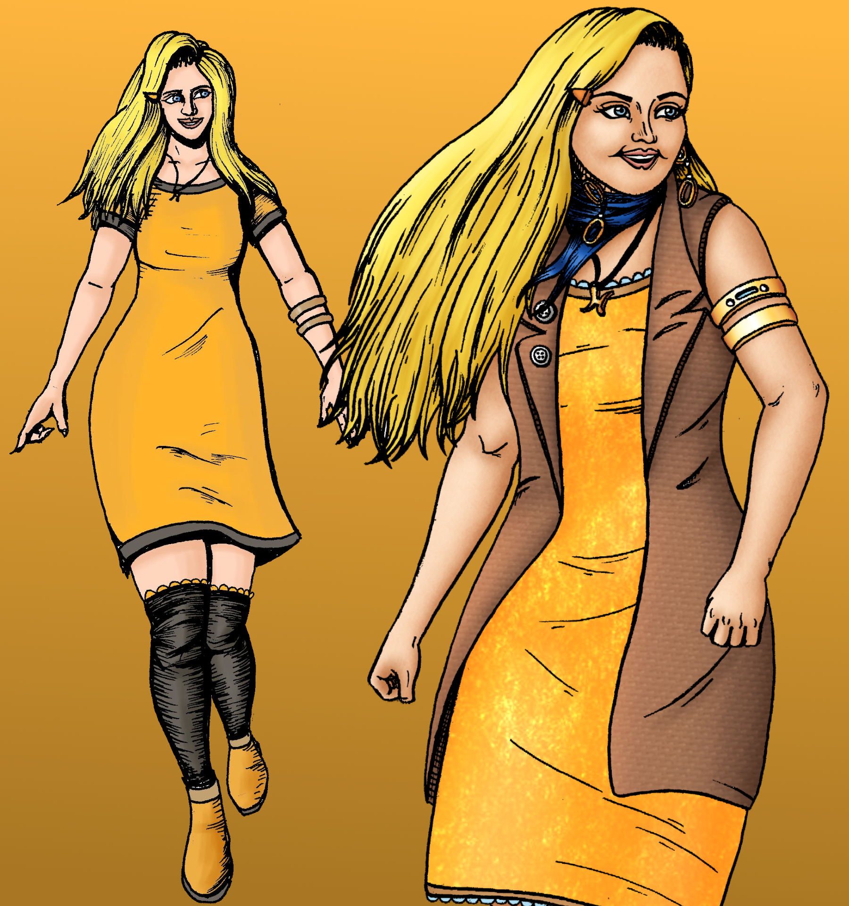

<blockquote>
 "I'm not going to be punching bad guys. I'm just going to look at crime scenes, maybe talk to some suspects - just putting the pieces together. It's not too different from what I'm doing now is it?"
</blockquote>

-Madeline Harbour<a href="https://www.ezequielespinoza.com/heroine-rises/3/6">[1]</a>

**Madeline Lindsay Harbour**, often referred to as **Maddie**, is a young woman who acts as an amateur detective or private investigator within the city of Northern Serenity. Madeline is mainly known for her small-time detective status. During her high school days she would take on small cases and solve them with a combination of careful investigation and luck.

Madeline's altruistic personality drives her to be a role model or 'Heroine' for the community. Madeline has a rather naive outlook on the city as she was born into wealth and has never seen or understands the deeper reasons as to why criminals act the way they do. Therefore, she sometimes comes across as 'out-of-touch'.
Her desire to do good causes her to take on big criminal cases that the local police don't bother with. She starts with the *Ring of Deceit* case. Madeline hopes that by resolving more difficult cases she can eventually solve the mystery behind her father's disapperance.

<h2>Background</h2>

</img>
<figcaption>A young Madeline Harbour</figcaption>

Madeline was born to Jacques and Clarissa Harbour in the Isle of Tranquility neighborhood in Northern Serenity. Due to being born in October, Clarissa would always dress Madeline in orange - a habit she has retained. Madeline was close with both of her parents. When her father Jacques vanished from her life, Clarissa became very protective of her daughter. Madeline's adventurous spirit often clashed with Clarissa's hesitance to take risks.

During Madeline's childhood, Clarissa would get her daughter involved in sports. When Madeline's foot was hurt after a rough tackle in her youth soccer game, Clarissa took her out of all contact sports as a precaution. Madeline would excel in ballet, gymnastics, and tennis before stopping her athletic pursits to start her detective journey.

Eventually, Madeline would try to loosen Clarissa's grip on her life. Bit by bit, Madeline would persist in trying to convince her mother to give her more freedoms with the help of Juliette Sandover. 

Madeline would eventually ask her mother for permission to take up big cases by promising Clarissa that by solving cases, Madeline would get enough experience to find out what happened to Jacques Harbour. 

##Personality
Madeline can be described as kind, empathetic, optimistic, calculating, and quite naive. Madeline, much like her mother Clarissa, has inherited a compassion for others and does her best to try to understand people's intentions and emotions. This empathy is usually the way she resolves problems - as seen in encounters with Felix Zuniga and Irene Lassiter. Madeline cares deeply for almost everyone and is willing to see past people's flaws and pasts. 
While this has helped her solve cases and communicate with all sorts of people, this trait is often exploited.

Due to being born wealthy and living in the comfort of the Isle of Tranquility, Madeline does not have a good grasp on what goes on outside of wealthy and privileged lifestyles. At the start of her journey, Madeline tries to apply her worldview to make sense of the actions of those less fortunate than her. This can be seen in her first encounter with Jimmy Jarvis. During this encounter, Jimmy showed frustration at Madeline's responses to his explanations. Madeline told Jimmy that he cheated on tests due to a lack of study time. Jarvis responds by telling her that his rough lifestyle does not grant him the luxuries that Madeline has taken for granted. In further encounters with people like Felix Zuniga and Irene Lassiter, Madeline does this again. However, as time passes, Madeline learns from her mistakes and does her best to try and understand that there are many different situations and holds her tounge before speaking.

Madeline often shifts between a strong leader and an insecure imposter. Bluffing is something she does often but her confident facade can easily collapse if someone presses her as seen with Irene Lassiter.

##Apperance and Physical

</img>
<figcaption>Madeline's dresses</figcaption>

Madeline has fair-colored skin and long straight blonde hair that reaches halfway down her back. Her eyes are a light blue. She stands at five foot 6 inches but often times wears shoes that make her a few inches taller.

Madeline often wears dresses and is very fond of the color orange - which she incorporates in most of her outfits. Madeline wears a hair clip on the right side of her head that matches or compliments the color of her current outfit. She always wears a gold necklace in the shape of the letter 'H' and a golden bracelet that doubles as a GPS tracker on one of her arms. She is also fond of boots and closed toe shoes with a heel to make her appear taller. Madeline likes to add a jacket or vest atop her dresses.

Madeline has a thin body build and is capable of acrobatic feats like handstands, cartwheels, and flips due to her gymnastics background. Madeline is remarkably flexible. While she lacks muscle and combat intelligence, Madeline can pose a threat in fights due to her nimble movement and tendency to use tools and environment to her advantage.
