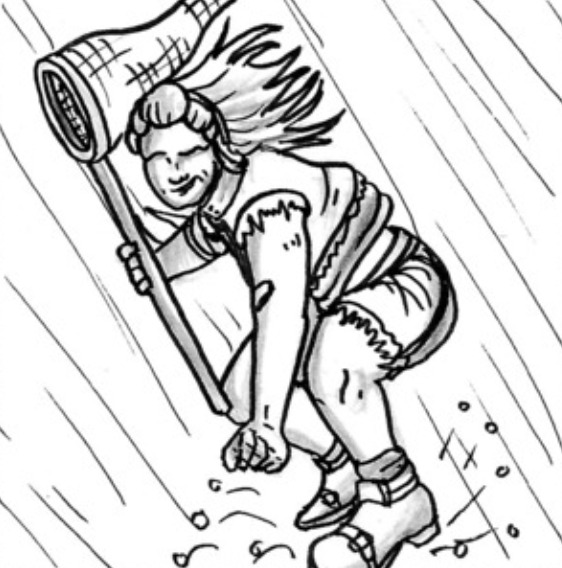
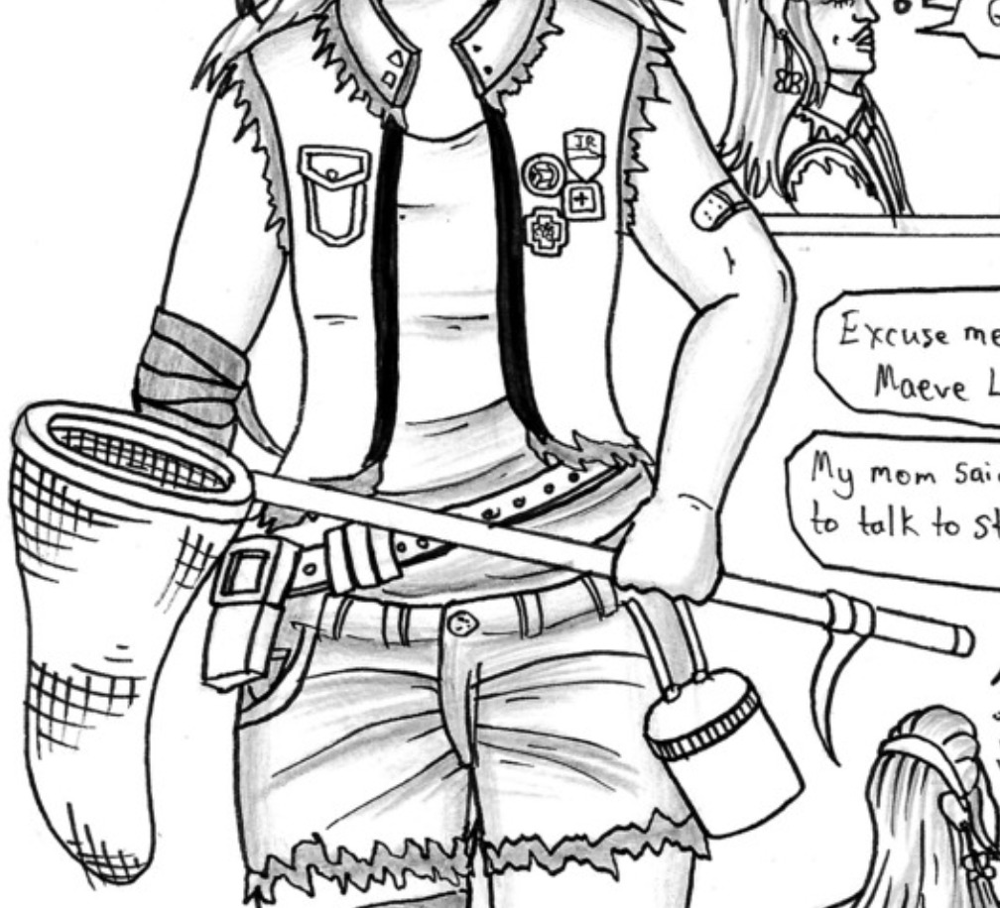

<blockquote>
 "Tea time and not having to worry about rats was a nice change."
</blockquote>

-Maeve Colbrun<a href="https://www.ezequielespinoza.com/heroine-rises/10/5">[1]</a>

**Maeve Colbrun-Lassiter**, is the teenage daughter of Irene Lassiter and an honorary member of Madeline Harbour's detective team. Maeve lives inside a trailer with her mother deep in the **Coastal Swamp** region of Northern Serenity. Maeve is often referred to as 'Butterfly' for her love of butterflies and her tendency to be a glimmer of optimism in bleak situations.

Maeve's father is unknown and she seems to not like to talk about the specifics of her upbringing. Due to her rough upbringing, short-tempered mother, and the difficulty in finding her home - Maeve has a hard time making friends and gets very lonely. Upon meeting Madeline and her team, Maeve instantly tries to form a connection with them by helping them find her mother on the condition that they become her new 'best friends'.

##Background

Maeve is the only child of Irene Lassiter and an unnamed father. Maeve appears to have lived with only her mother for a long period of her life. Maeve mentions that Irene's gang history and spats with others force the two of them to move constantly. Eventually the two end up hiding out in a trailer deep in the Coastal Swamp. 

During this time, Maeve sought friends but mentioned that her mother scared them all away as seen with the Serenity Scouts incident<a href="https://www.ezequielespinoza.com/heroine-rises/10/3">[2]</a>.

##Personality

Maeve can be described as friendly and excitable. Maeve tries her best to obey her mother's orders but she can very easily be convinced to break the rules. Maeve loves to meet new people and tries to befriend anyone she deems interesting. 

Upon meeting Madeline Harbour and learning that she is a detective, Maeve instantly becomes attached to her and tries to convince them to sleepover at her place.

</img>
<figcaption>Navigating Coastal Swamp</figcaption>

Maeve loves to talk about herself and her interests, which include butterfly collecting. Maeve has a sizeable collection of butterflies she has collected over the years in her bedroom. Maeve seems to love the outdoors and is fully capable of fearlessy navigating the tricky Coastal Swamp without much issue.

##Appearance

Maeve shares the same light colored skin as her mother and has an athletic build. She has visible scars on her upper legs. She often has bandages on her body to cover the small injuries she sustains when navigating the Coastal Swamp. Maeve has light brown hair that she usually pins back wears with a magenta colored headband. She also likes to wear her hair down when not chasing butterflies or hiking. Maeve's eyes are also a light brown. 

</img>
<figcaption>Maeve's Equipment</figcaption>

Maeve wears a full magenta colored outfit. She wears a visibly distressed magenta colored denim jacket. Maeve wears her collection of unoffical Serenity Scout badges on this jacket. Her ripped jean shorts also match this jacket's color. Maeve carries butterfly catching equipment with her at all times - even if she doesn't carry her net with her.

Physically, Maeve is suprisingly strong for her appearance. She is also agile and nimble. Due to her butterfly hobby and home location, Maeve has very high endurance and rarely gets tired.