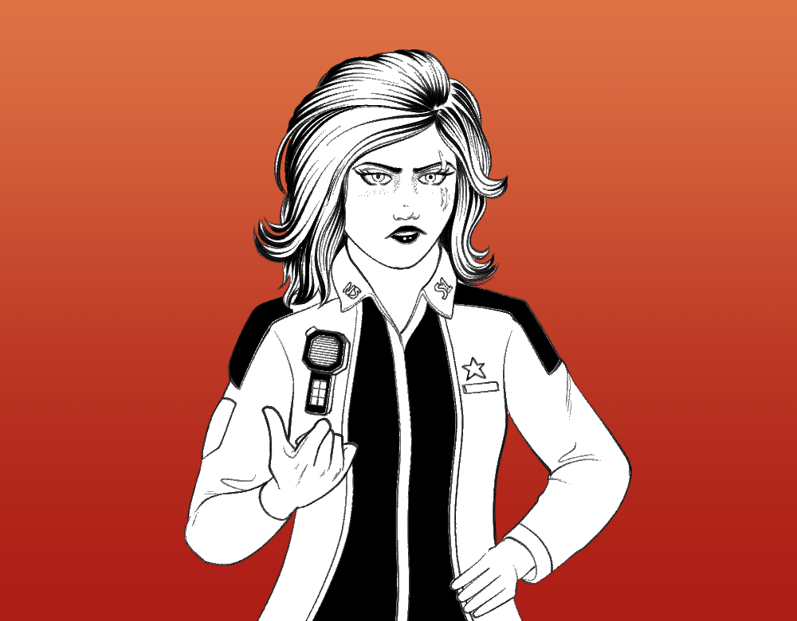
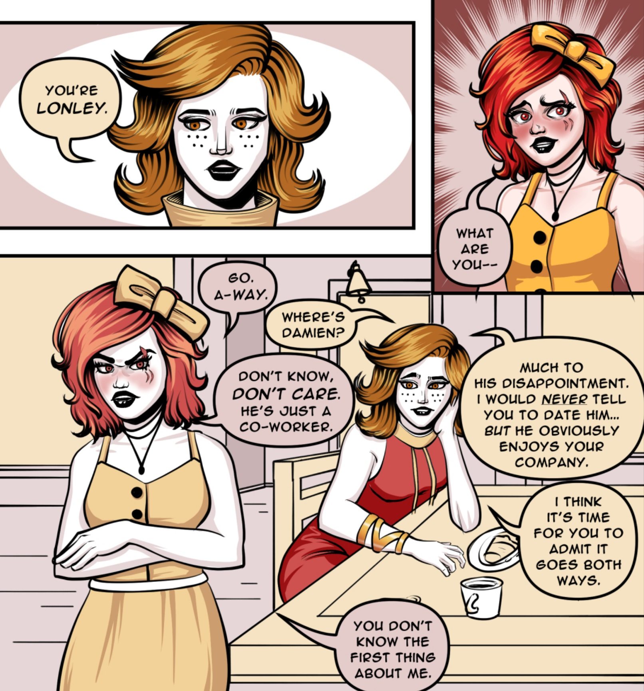
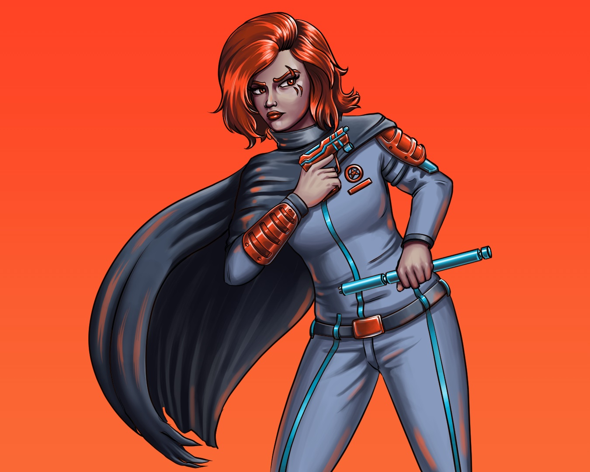
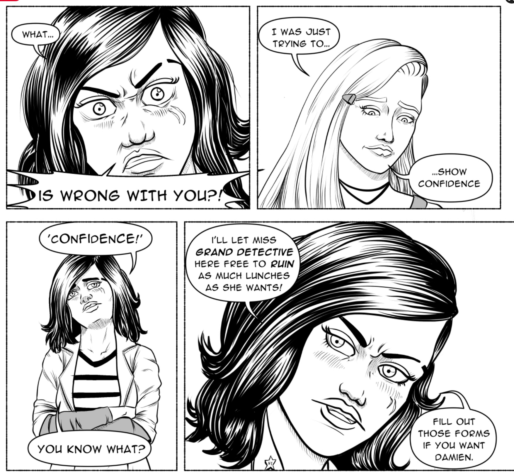
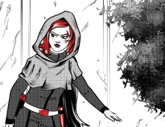

<blockquote>
 "As a sworn officer of the <b>LAW</b> I can't just let you grab whatever you want! There's a line to how much I'm willing to for you before <b>I</b> get in trouble."
</blockquote>

-Maxine Rubin to Juliette Sandover<a href="https://www.ezequielespinoza.com/heroine-rises/6/12">[1]</a>

Sergeant **Maxine Amelia Rubin** is a young officer within the Northern Serenity Police Department. During the events of *The Ring of Deceit* arc, she forms an unofficial duo with Officer Damien Schmidt. Maxine is touted as a rising star within the department and is one of the youngest officers to reach the Sergeant rank. 

Maxine's devotion to her personal definition of the NSPD's motto - 'For Justice and the Greater Good' - cause her to be in constant conflict with the NSPD's top officers and lower ranks when they do not share the same sentiment towards their goals. Maxine is headstrong, usually taking matters into her own hands and speaking exactly what is on her mind - regardless of ranking or respect.

Maxine has an intense hatred of criminals, stemming from her childhood where she witnessed her mother Veronica Rubin get killed at the hands of Rust Bandit Commander 'Drill'. Since then, Maxine has sought revenge against Drill but also towards any criminals she encounters. Damien typically has to reel Maxine in as she has a tendency to use excessive force when heated.

##Background

Maxine was born in the Chantilly neighborhood of Northern Serenity to Caspar and Veronica Rubin. She lives in her childhood home with her father Caspar. Maxine was born in a middle-class neighborhood that was the location of constant clashes between the NSPD and the gangs of the West.

</img>
<figcaption>Maxine Rubin in her custom NSPD Uniform Jacket</figcaption>

During her childhood, Maxine grew to love her father's work as a police scientist and her mother's philosophy towards criminals. Maxine would gain an understanding of the criminal justice system and the flaws with Northern Serenity since her mother was the District Attorney. Veronica Rubin would be killed at the hands of the Rust Bandits, causing Maxine to join the NSPD with the intent of seeking indivdual revenge and carrying on a warped version her mother's 'Justice'.

Maxine excelled in physical and traditional tests - enabling her to become a cadet early on. Her devotion and drive to stop criminals quickly caught the attention of higher ups, who would keep tabs on her. Maxine would go on to be promoted several times before the start of Heroine Rises - reaching the Sergeant rank by the time Madeline Harbour confronts Damien Schmidht.

As Maxine's influence within the NSPD grows, so does opposition. Maxine's efforts to reform the department are constantly stifled by the higher-ups and as a result, she tries to recruit team members to help her with her goals.

##Personality and Traits

Maxine can be described as aggresive, cold, short-tempered, and extremely driven. Like her father Caspar, Maxine has become a part of the NSPD and is driven to be the best officer she can be - at the cost of a social life. Maxine's devotion to her goals with the NSPD have led her to have very little friends or hobbies outside of police work. This lonlieness affects Maxine deeply but she prefers to ignore her feelings and cope by doing more work or training. As a result, Maxine is usually high strung and short-tempered.

</img>
<figcaption>Maxine's aversion to talking about her feelings.</figcaption>

Maxine partially blames her father Caspar for Veronica's death and the two share an uneasy relationship as a result. Caspar does his best to be a good father but Maxine is very hard to impress and does not attempt to foster a close relationship with her only family. Clarissa Harbour has noted that Maxine does not know who or what was to blame for Veronica's death but chooses to cope with the event by blaming others. Clarissa also notes that Maxine might have re-imagined some of the memories she had of her mother's death and past, adjusting them so that they fit Maxine's worldview. 

While she never would admit, Maxine cares deeply for those who choose to remain involved in her life. Caspar, Juliette, and Damien are among the only people Maxine would secretly consider 'loved ones'. Maxine, when with people she likes, retains her sharp personality but is not actively trying to push them away. In contrast, when meeting with someone she does not care for, she will make every possible attempt to make that person go away, spoiling any situation with her anger and pettiness.

Maxine has a love for donuts and pastries, something that is often exploited as a comedic weakness by Damien, Juliette, or Caspar to get Maxine out of a bad mood or to get her to do something.

##Appearance

</img>
<figcaption>Maxine's red hair and NSPD getup.</figcaption>

Maxine is a shorter woman with wavy red hair that she cuts above her shoulders. Maxine's hair is dyed red as her natural color is a lighter brown that she inherited from her father. Her eyes are a light brown, though they are often depicted as red in promotional art. Maxine has a short and round nose. Maxine's skin is a pale white that easily turns flush when angry, flustred, or in hot enviornments. The skin below Maxine's eyes is always flushed and slightly reddened at all times. Maxine has three distinct scars on the left side of her face, given to her by Rust Bandit Commander Drill at different times before the start of the *Heroine Rises* timeline.

Maxine is often wearing some variation of the NSPD uniform. Due to lax enforcement of the uniform policy, Maxine is able to customize her uniform which she does by adding a custom made light colored leather jackets atop variations of the NSPD uniform shirt. While she does not wear the exact same outfit everyday, Maxine often wears slight variations of the jacket/shirt combination. She wears dark colored pants and appears to be very fond of calf and knee height boots that she wears in black or brown. In more dangerous situations, Maxine's outfit of choice consists of the ADIRA Rouge 1 Light Armor with various armor plates depending on the risk. After *FireStarter*, Maxine wears a set of Vulcan Armory Commander Armor in the highest risk situations.

Outside of the NSPD, Maxine does not seem to have a defined style and simply wears whatever she 'likes and feels' with no regard to style consistencies. When she is feeling 'cute' or 'casual', Maxine will wear pastel colors and is partial to a dress. She likes to wear an oversized bow on her head, a callback to her youth when her father would dress her. In more 'serious' moods, Maxine wears open leather jackets with jeans and boots, similar to her NSPD outfits in all but branding and color.

##Abilites and Combat

</img>
<figcaption>Maxine in ADIRA Rouge 1 armor, wielding a 'Cumulus' taser and a 'SuperCell' baton.</figcaption>

As a police officer, Maxine is combat trained and adept at handling dangerous situations. Maxine is skilled in hand-to-hand combat and shows a decent amount of strength when pressed. However, Maxine prefers to use weapons and tools in place of her fists. Maxine's weapons of choice consist of the Electron Innovations *'Cumulus'* ElectroShock Weapon. While standard issue tasers consist of a single powerful electric shot - Electron *'Stratus'* Model, Maxine prefers the *Cumulus* weaker individual shots in exchange for a larger magazine.

On her other hip, Maxine has an Electron Innovations *'SuperCell'* model stun baton. Made of steel and capable of electric shocks, the taser is used by Maxine in close combat, oftentimes without the shock function so it serves as a regular baton.

Maxine is shown to be quite agile but not to the extent of Madeline or Juliette. Maxine is not capable of acrobatics in any form but shows remarkable physical endurance. She has a high pain tolerance and is able to brush off hard hits and power through injury to continue a battle or achieve some goal.

##Biography

###The Ring of Deceit

####Small-Time Detective

</img>
<figcaption>Maxine's annoyance towards Madeline Harbour.</figcaption>

During her senior year at Riverview High School, Maxine Rubin spent her free time attempting to recruit someone to join her side in the NSPD. Many classmates held a negative opinion on Maxine and therefore turned her offers down. Desperate, Maxine crosses out every senior classmate bar one - Damien Schmidt, who she deeply does not want to partner with. However, realizing she can't get ahead in her NSPD career without someone advocating for her, Maxine meets with Damien in order to ask him to join her side at the NSPD.

While talking to Damien about her vision for the NSPD, Madeline Harbour confronts Damien about his involvement with a group of kids who conspired to steal an answer sheet. Damien opts to run, prompting Madeline and Julian Gaitan to chase him, while Maxine remains frustrated at her inability to recruit anyone to her side.

Maxine finds Damien afterschool, where he recounts the answer sheet theft operation and his encounter with Madeline. Maxine tells Damien that his parents would probably go easy on him if he managed to get a job for the summer. Damien agrees and joins Maxine's side at the NSPD.

####Serenity East Arc

Maxine Rubin would train with Damien during their time at the NSPD. The two learned to work together and embarked on various low level missions around the Serenity East Island. They would occasionally run into Madeline Harbour and her team, to which Maxine would express annoyance at Madeline's 'detective game'. When Madeline begins to pursue Jamie and Alfonso in along the streets of RiverView and then the Vista Del Rio Highway, Maxine is one of the officers who tags along with Ashley Carter to investigate.

###FireStarter

<blockquote>
 "The Earth and her moon."
</blockquote>

-Maxine Rubin to Yuri Maximillian on what it would take to bribe her.

####Criminal Pursuit
After the collapse of Serenity Underground during the Ruby Mine Conflict, the subsequent Special Election resulted in Governor Edward Blake losing a signifigant amount of political power in the Northern Serenity Government. This vaccuum of power allowed the gangs of the West to make their presence even bigger as the restructured NSPD could not handle the massive strain caused by an increase in gang power.

</img>
<figcaption>Maxine infiltrating Yuri's apartment.</figcaption>

Maxine Rubin, a few missions away from promotion to Lieutenant, decides that the best thing she can do is to arrest a well-known mid-tier criminal called Yuri Maximillian. Yuri is known for bribing public officials in order to retain their silence on an unknown operation. Collecting enough evidence to produce an arrest warrant, Maxine and Damien infiltrate Yuri's residence at Serenity Heights and arrest him after a brief struggle.

Maxine's efforts are not rewarded with promotion, instead, she is sent on a meaningless patrol shift, meant to discourage her from stepping out of line and disrupting the NSPD-Gang understanding. Maxine takes out her anger on a pair of brothers who she caught vandalizing a building. Realizing her brutality laced policing style, Damien refuses to work with Maxine and wants to leave the NSPD. However, the two encounter a Mother who begs the two officers to help her, as her Daughter has been kidnapped by a Rust Bandit. Against orders from Edward Blake and Commander Ashley Carter to let the Daughter go, Maxine and Damien pursue the kidnapper who turns out to be Rust Bandit Commander Drill. Despite Maxine and Damien's best efforts, they are defeated and captured by the Commander, who takes the two to the Rust Bandit occupied Sanctuary Towers Hospital Center.

####Sanctuary's Secrets

####For Justice and the Greater Good